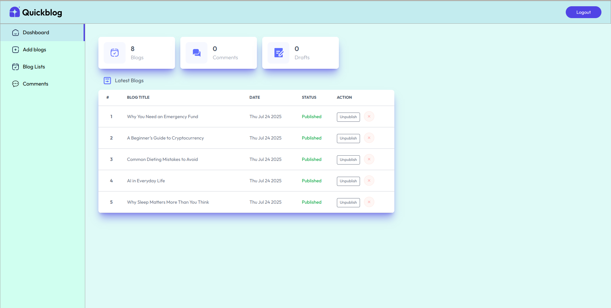
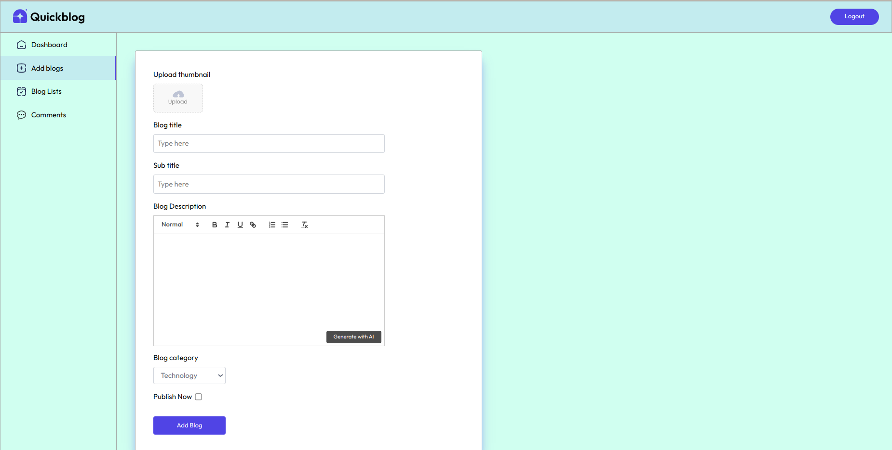
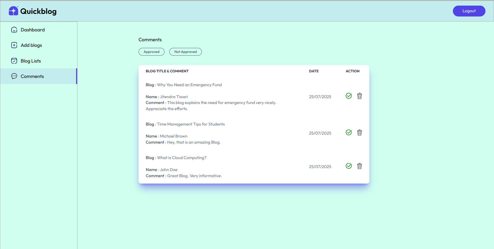
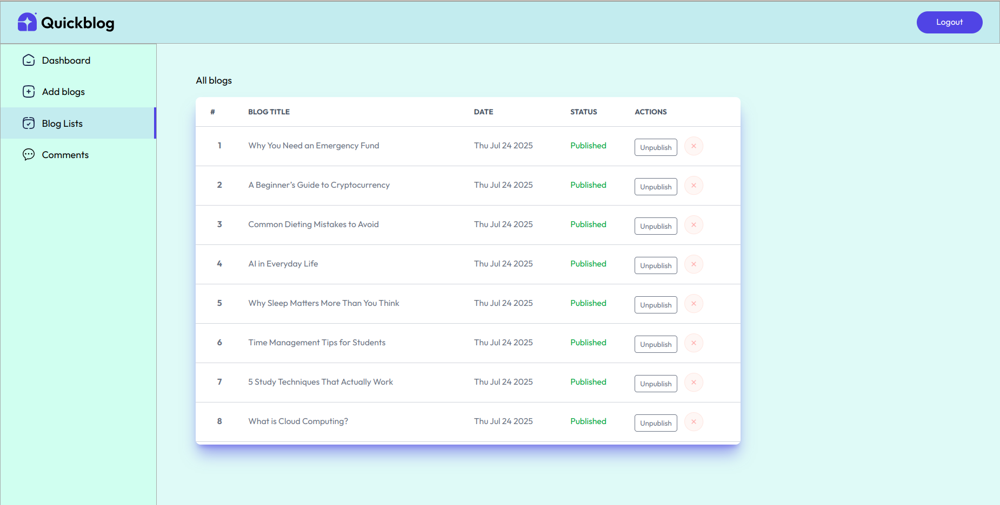

# 🧠 AI-Powered Blogging Platform using MERN Stack & Gemini API

[](https://opensource.org/licenses/MIT)


---

## 🧠 Overview

**Blog-App-Mern-Stack** is an **AI-powered full-stack blogging platform** built using the **MERN stack** (MongoDB, Express.js, React.js, Node.js) and integrated with the **Google Gemini API** for AI-assisted blog content creation. Admins can write or generate blogs, review user comments, and manage content. Users can view blogs and leave moderated comments.

> 🔗 **Live Demo**: [https://blog-app-mern-stack-seven.vercel.app/](https://blog-app-mern-stack-seven.vercel.app/)

---

## 🚀 Key Features

- 📝 **Admin Dashboard**: Add, edit, or delete blogs. Generate content using Gemini API. Moderate comments.
- 👥 **User Access**: Browse blogs, read full posts, and comment (pending admin approval).
- 🤖 **Gemini-Powered AI**: Use natural language prompts to auto-generate blog drafts.
- 🌐 **Full-Stack MERN Architecture**: Cleanly structured client-server setup with RESTful APIs.
- 📬 **API Testing via Postman**: All backend routes tested with Postman collections.
- ⚡ **Deployed on Vercel**: Frontend hosted for fast access; backend can be deployed separately.

---

## 🧰 Technologies Used

| Technology             | Purpose                                   |
|------------------------|-------------------------------------------|
| **MongoDB**            | Database for storing blogs and comments   |
| **Express.js**         | Backend server and RESTful APIs           |
| **React.js**           | Frontend framework                        |
| **Node.js**            | Runtime for backend logic                 |
| **Gemini API**         | Content generation via Google AI          |
| **Tailwind CSS**       | Frontend styling                          |
| **Vercel**             | Frontend hosting                          |
| **Postman**            | API testing and validation                |

---

## 🔐 Admin Access

Admin credentials are **not publicly shared** for security reasons.

If you're testing the project locally, you can configure a test admin user securely using environment variables (`ADMIN_EMAIL`, `ADMIN_PASSWORD`).

Avoid hardcoding or sharing real credentials in the codebase or public documentation.

---

## 🔧 Environment Variables

The backend uses environment variables to manage credentials and sensitive keys.  
Create a `.env` file inside the `/server` directory based on the following template:

```env
# .env.example

# Admin credentials for login
ADMIN_EMAIL=your-admin-email@example.com
ADMIN_PASSWORD=your-secure-password

# JWT token secret
JWT_SECRET=your_jwt_secret_key

# MongoDB database connection
MONGO_URI=your_mongodb_connection_string

# Gemini API key for blog generation
GEMINI_API_KEY=your_google_gemini_api_key

# Optional port
PORT=5000
```

## 📸 Sample Screenshots of the Admin Section

<div style="display: flex; justify-content: center;">
    
    
     
    
</div>

---

## License

This project is licensed under the MIT License. See the `LICENSE` file for more details.

---

## Author

**Abhinav Marlingaplar**  
